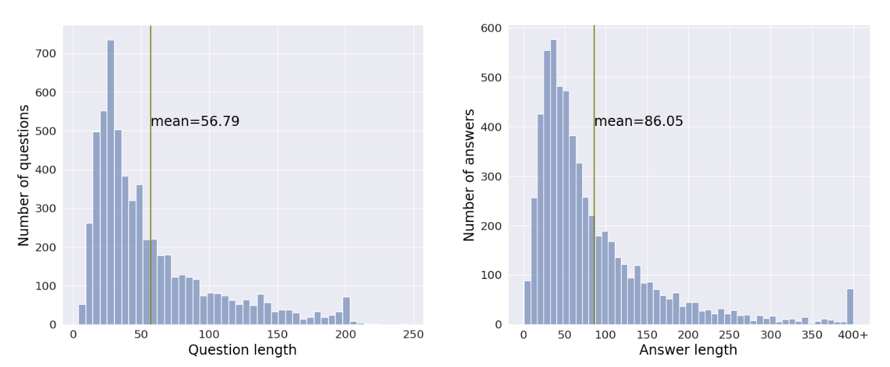

# FinTruthQA: A Benchmark Dataset for Evaluating the Quality of Financial Information Disclosure

This repository includes the dataset and benchmark of the paper:

**FinTruthQA: A Benchmark Dataset for Evaluating the Quality of Financial Information Disclosure**

**Authors**: Ziyue Xu, Peilin Zhou, Xinyu Shi, Jiageng Wu, Yikang Jiang, Bin Ke, Jie Yang

## Abstract
Accurate and transparent financial information disclosure is crucial in the fields of accounting and finance, ensuring market efficiency and investor confidence. Among many information disclosure platforms, the Chinese stock exchanges' investor interactive platform provides a novel and interactive way for listed firms to disclose information of interest to investors through an online question-and-answer (Q&A) format. However, it is common for listed firms to respond to questions with limited or no substantive information, and automatically evaluating the quality of financial information disclosure on large amounts of Q&A pairs is challenging. This paper builds a benchmark FinTruthQA, that can evaluate advanced natural language processing (NLP) techniques for the automatic quality assessment of information disclosure in financial Q\&A data. FinTruthQA comprises 6,000 real-world financial Q&A entries and each Q&A was manually annotated based on four conceptual dimensions of accounting: _question identification_, _question relevance_, _answer readability_, and _answer relevance_. We benchmarked various NLP techniques on FinTruthQA, including statistical machine learning models, pre-trained language model and their fine-tuned versions, as well as the large language model (LLM) GPT-4.  Experiments showed that existing NLP models have strong predictive ability for _question identification_ and _question relevance_ tasks, but are suboptimal for _answer readability_ and _answer relevance_ tasks. By establishing this benchmark, we provide a robust foundation for the automatic evaluation of information disclosure, significantly enhancing the transparency and quality of financial reporting. FinTruthQA can be used by auditors, regulators, and financial analysts for real-time monitoring and data-driven decision-making, as well as by researchers for advanced studies in accounting and finance, ultimately fostering greater trust and efficiency in the financial markets. 

## Dataset
We collected Q&A entries from the interactive platforms for communication between investors and listed companies established by the Shanghai Stock Exchange(SSE) and the Shenzhen Stock Exchange(SZSE). The data from the SSE covers the timeframe from January 4, 2016, to December 31, 2021, while the data from the SZSE spans from September 1, 2021, to May 31, 2022. Each Q&A entry was annotated based on four key information disclosure quality evaluation criteria: _question identification_, _question relevance_, _answer relevance_, and _answer readability_.

### Data Statistics
The figure below shows the distribution of questions and answers in FinTruthQA(in characters).

### Data Access

The data are available in `dataset` folder, which are saved in a CSV format.

### Annotation Guidelines
We focuses on four key information disclosure quality evaluation criteria: _question identification_, _question relevance_, _answer relevance_, and _answer readability_. These criteria are widely recognized as crucial indicators of information quality and are important for investors to consider when evaluating Q&A information.  
More details can be found in our guidelines (see `annotation guidelines/`).  Both Chinese version and English version are released.

## Model Benchmarking 

To reproduce the results of ML-based model, users could use the [scikit-learn library](https://scikit-learn.org/stable/).

All the experiments of PLM-based models are conducted using [PyTorch](https://github.com/pytorch/pytorch) and [HuggingFace’s framework](https://github.com/HuggingFace).

The links to the PLM models are here:

* **[`BERT`](https://huggingface.co/google-bert/bert-base-chinese)**
* **[`RoBERTa`](https://huggingface.co/hfl/chinese-roberta-wwm-ext)**
* **[`FinBERT`](https://github.com/valuesimplex/FinBERT)**
* **[`Mengzi-fin`](https://huggingface.co/Langboat/mengzi-bert-base-fin)**
* **[`DKPLM`](https://huggingface.co/alibaba-pai/pai-dkplm-financial-base-zh)**
* **[`SBERT-nli`](https://huggingface.co/uer/sbert-base-chinese-nli)**
* **[`RoBERTa-extractive-qa`](https://huggingface.co/uer/roberta-base-chinese-extractive-qa)**
* **[`BERT (Large)`](https://huggingface.co/yechen/bert-large-chinese)**
* **[`RoBERTa (Large)`](https://huggingface.co/hfl/chinese-roberta-wwm-ext-large)**

The continued pre-training was performed based on the UER framework. Below is the link to the library:
* **[`UER: An Open-Source Toolkit for Pre-training Models`](https://github.com/dbiir/UER-py)**

### Leaderboard
We reported the results, namely mean ± std, based on experiments on 3 different random seeds: 12, 42, and 123. Mean is calculated by averaging the performances of different seeds. Std denotes the standard error, which is calculated by dividing the standard deviation of the mean value by the square root of the number of seeds.

#### Task 1 & 2: Question identification and Question relevance

#### Task 3: Answer readability

#### Task 4: Answer relevance

## Cite

If you use FinTruthQA in your paper, please cite [our paper](https://arxiv.org/abs/2406.12009):

@misc{xu2024fintruthqa,
      title={FinTruthQA: A Benchmark Dataset for Evaluating the Quality of Financial Information Disclosure}, 
      author={Ziyue Xu and Peilin Zhou and Xinyu Shi and Jiageng Wu and Yikang Jiang and Bin Ke and Jie Yang},
      year={2024},
      eprint={2406.12009},
      archivePrefix={arXiv},
      primaryClass={cs.CL},
      url={https://arxiv.org/abs/2406.12009}, 
}

## Contact

If you have any questions about our dataset or benchmark results, please feel free to contact us!
(Ziyue Xu, zyxu1224@gmail.com; Jie Yang, jieynlp@gmail.com)
